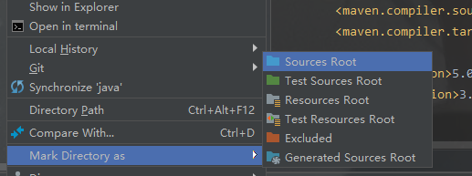

# SSM整合流程

## 1. 事前准备

###  创建项目

首先创建一个Maven工程，因为之后要整合SpringMVC，所以这里创建一个web工程。


按照提示完成项目的创建。

### 创建基本的目录结构

在src->main目录下创建`java`和`resources`目录,然后右键两个目录分别指定为Source Root和Resource Root。



## 2. 导入相关依赖

pom.xml

```xml
<properties>
    <!-- 版本管理 -->
    <spring.version>5.1.5.RELEASE</spring.version>
</properties>
<dependency>
     <groupId>junit</groupId>
     <artifactId>junit</artifactId>
     <version>4.11</version>
     <scope>test</scope>
</dependency>

<!-- ************** 1.Spring ************** -->
<!-- 1)Spring核心 -->
<dependency>
    <groupId>org.springframework</groupId>
    <artifactId>spring-context</artifactId>
    <version>${spring.version}</version>
</dependency>
<!-- 2)Spring DAO层 -->
<dependency>
    <groupId>org.springframework</groupId>
    <artifactId>spring-jdbc</artifactId>
    <version>${spring.version}</version>
</dependency>
<!-- 事务控制 -->
<dependency>
    <groupId>org.springframework</groupId>
    <artifactId>spring-tx</artifactId>
    <version>${spring.version}</version>
</dependency>
<!-- 解析事务配置的切入点表达式 -->
<dependency>
    <groupId>org.aspectj</groupId>
    <artifactId>aspectjweaver</artifactId>
    <version>1.9.2</version>
</dependency>
<!-- 3)Spring web -->
<dependency>
    <groupId>org.springframework</groupId>
    <artifactId>spring-web</artifactId>
    <version>${spring.version}</version>
</dependency>
<dependency>
    <groupId>org.springframework</groupId>
    <artifactId>spring-webmvc</artifactId>
    <version>${spring.version}</version>
</dependency>
<!-- 4)Spring test -->
<dependency>
    <groupId>org.springframework</groupId>
    <artifactId>spring-test</artifactId>
    <version>${spring.version}</version>
</dependency>

<!-- ************** Dao： Mybatis ************** -->
<!-- https://mvnrepository.com/artifact/org.mybatis/mybatis-spring -->
<dependency>
    <groupId>org.mybatis</groupId>
    <artifactId>mybatis-spring</artifactId>
    <version>1.3.2</version>
</dependency>
<!-- https://mvnrepository.com/artifact/org.mybatis/mybatis -->
<dependency>
    <groupId>org.mybatis</groupId>
    <artifactId>mybatis</artifactId>
    <version>3.4.6</version>
</dependency>

<!-- **************  数据库 **************  -->
<!-- 添加mysql驱动依赖 -->
<dependency>
    <groupId>mysql</groupId>
    <artifactId>mysql-connector-java</artifactId>
    <version>5.1.45</version>
</dependency>
<!-- 数据库连接池 -->
<dependency>
    <groupId>com.alibaba</groupId>
    <artifactId>druid</artifactId>
    <version>1.0.20</version>
</dependency>

<!-- ************** 3.Servlet web ************** -->
<dependency>
    <groupId>jstl</groupId>
    <artifactId>jstl</artifactId>
    <version>1.2</version>
</dependency>
<dependency>
    <groupId>com.fasterxml.jackson.core</groupId>
    <artifactId>jackson-databind</artifactId>
    <version>2.10.0</version>
</dependency>
<dependency>
    <groupId>javax.servlet</groupId>
    <artifactId>javax.servlet-api</artifactId>
    <version>3.1.0</version>
</dependency>

<!-- ************** log4j ************** -->
<dependency>
    <groupId>org.apache.logging.log4j</groupId>
    <artifactId>log4j-web</artifactId>
    <version>2.10.0</version>
</dependency>
```

## 3. web.xml

```xml
<?xml version="1.0" encoding="UTF-8"?>
<!DOCTYPE web-app PUBLIC
        "-//Sun Microsystems, Inc.//DTD Web Application 2.3//EN"
        "http://java.sun.com/dtd/web-app_2_3.dtd" >
<web-app xmlns:xsi="http://www.w3.org/2001/XMLSchema-instance" xmlns="http://java.sun.com/xml/ns/javaee"
         xsi:schemaLocation="http://java.sun.com/xml/ns/javaee http://java.sun.com/xml/ns/javaee/web-app_2_5.xsd"
         id="WebApp_ID" version="2.5">

    <display-name>Archetype Created Web Application</display-name>

    <welcome-file-list>
        <welcome-file>/WEB-INF/index.jsp</welcome-file>
    </welcome-file-list>

    <!-- 1. 加载spring容器 -->
    <context-param>
        <param-name>contextConfigLocation</param-name>
        <param-value>classpath:spring/applicationContext.xml</param-value>
    </context-param>

    <!-- 配置spring的字符编码过滤器，保证request请求的中文字符不会乱码（注意这个过滤器要放到最前面） -->
    <filter>
        <filter-name>CharacterEncoding</filter-name>
        <filter-class>org.springframework.web.filter.CharacterEncodingFilter</filter-class>
        <init-param>
            <param-name>encoding</param-name>
            <param-value>utf-8</param-value>
        </init-param>
        <init-param>
            <param-name>forceRequestEncoding</param-name>
            <param-value>true</param-value>
        </init-param>
        <init-param>
            <param-name>forceResponseEncoding</param-name>
            <param-value>true</param-value>
        </init-param>
    </filter>
    <filter-mapping>
        <filter-name>CharacterEncoding</filter-name>
        <!-- 设置这个字符编码过滤器作用与每一个请求 -->
        <url-pattern>/*</url-pattern>
    </filter-mapping>

    <!-- RESTful风格URL用 -->
    <filter>
        <filter-name>hiddenHttpMethodFilter</filter-name>
        <filter-class>org.springframework.web.filter.HiddenHttpMethodFilter</filter-class>
    </filter>
    <filter-mapping>
        <filter-name>hiddenHttpMethodFilter</filter-name>
        <url-pattern>/*</url-pattern>
    </filter-mapping>

    <!-- 配置Spring的servlet监听器 -->
    <listener>
        <listener-class>org.springframework.web.context.ContextLoaderListener</listener-class>
    </listener>

    <!-- 配置springmvc的前端控制器，request请求会先经过这个控制器 -->
    <servlet>
        <servlet-name>dispatcherServlet</servlet-name>
        <servlet-class>org.springframework.web.servlet.DispatcherServlet</servlet-class>
        <!-- contextConfigLocation配置springmvc加载的配置文件(配置处理器映射器，适配器)
         如果不配置，默认加载的是/WEB-INF/servlet名称-servlet.xml(springmvc-servlet.xml)-->
        <init-param>
            <param-name>contextConfigLocation</param-name>
            <param-value>classpath:spring/springmvc.xml</param-value>
        </init-param>
        <load-on-startup>1</load-on-startup>
    </servlet>
    <servlet-mapping>
        <servlet-name>dispatcherServlet</servlet-name>
        <!--  url-patten:
          1.*.action,访问以.action结尾由DispatcherServlet进行解析；
          2./，所有访问的地址都由DispatcherServlet进行解析，对于静态的文件的解析需要配置不让DispatcherServlet解析
             使用此种方法可以实现RESTful风格的url；
          3./*，不对，使用此种配置，最终要转发到一个jsp页面时，仍然会由DispatcherServlet解析jsp页面
             不能根据jsp页面找到handler，会报错。
        -->
        <url-pattern>/</url-pattern>
    </servlet-mapping>
</web-app>
```

## 4. Spring-MVC

springmvc.xml

```xml
<?xml version="1.0" encoding="UTF-8"?>
<beans xmlns="http://www.springframework.org/schema/beans"
       xmlns:xsi="http://www.w3.org/2001/XMLSchema-instance"
       xmlns:mvc="http://www.springframework.org/schema/mvc"
       xmlns:context="http://www.springframework.org/schema/context"
       xsi:schemaLocation="http://www.springframework.org/schema/beans
        http://www.springframework.org/schema/beans/spring-beans.xsd
         http://www.springframework.org/schema/context
         http://www.springframework.org/schema/context/spring-context.xsd
         http://www.springframework.org/schema/mvc
         http://www.springframework.org/schema/mvc/spring-mvc.xsd">

    <!-- 开启注解扫描 -->
    <context:component-scan base-package="com.demo.controller"/>

    <!-- 配置springmvc的基本控制器，并开启了对json数据格式的支持 -->
    <!-- mvc注解驱动：可以代替注解映射器和适配器的配置
         mvc注解驱动默认加载了很多的参数绑定，比如默认加载json转换解析器
         如果使用该注解驱动，就不用配置注解映射器和适配器  -->
    <mvc:annotation-driven/>

    <!-- 对静态资源的访问 -->
    <mvc:resources mapping="/static/**" location="/WEB-INF/static/" />

    <!-- 配置springmvc的视图解析器 -->
    <bean class="org.springframework.web.servlet.view.InternalResourceViewResolver">
        <property name="prefix" value="/WEB-INF/"/>
        <property name="suffix" value=".jsp"/>
    </bean>
</beans>
```

## 5. 配置Spring

applicationContext.xml

```xml
<?xml version="1.0" encoding="UTF-8"?>
<beans xmlns="http://www.springframework.org/schema/beans"
       xmlns:xsi="http://www.w3.org/2001/XMLSchema-instance"
       xmlns:context="http://www.springframework.org/schema/context" xmlns:tx="http://www.springframework.org/schema/tx"
       xmlns:aop="http://www.springframework.org/schema/aop"
       xsi:schemaLocation="http://www.springframework.org/schema/beans http://www.springframework.org/schema/beans/spring-beans.xsd http://www.springframework.org/schema/context http://www.springframework.org/schema/context/spring-context.xsd http://www.springframework.org/schema/tx http://www.springframework.org/schema/tx/spring-tx.xsd http://www.springframework.org/schema/aop http://www.springframework.org/schema/aop/spring-aop.xsd">


    <!-- service层 配置注解扫描 -->
    <context:component-scan base-package="com.demo.service"/>

    <!-- 加载配置文件 -->
    <context:property-placeholder location="classpath:jdbc.properties"/>

    <!-- 配置数据源 数据库连接池 数据源不同需要导入的jar包也不容 -->
    <bean id="dataSource" class="com.alibaba.druid.pool.DruidDataSource">
        <property name="driverClassName" value="${jdbc.driver}"/>
        <property name="url" value="${jdbc.url}"/>
        <property name="username" value="${jdbc.username}"/>
        <property name="password" value="${jdbc.password}"/>
    </bean>

    <!--   配置SqlSessionFactory对象
        Spring与Mybatis完美整合，不予要mybatis的配置映射文件
        1. dataSource：配置数据源，连接数据库；
        2. configLocation：配置mabatis配置文件位置，加载mybatis的配置；
        3. mapperLocations：指明映射文件位置，自动扫描mapping.xml文件。
    -->
    <bean id="sqlSessionFactory" class="org.mybatis.spring.SqlSessionFactoryBean">
        <!-- 注入数据库连接池 -->
        <property name="dataSource" ref="dataSource"/>
        <!-- 扫描pojo包，使用别名配置(在mybatis中可以使用别名，即pojo的名称) -->
        <property name="typeAliasesPackage" value="com.tassel.entity"/>
        <!-- 扫描mapper的映射文件 -->
        <property name="mapperLocations" value="classpath:mapper/*.xml"/>
        <!-- 扫描Mybatis配置文件 -->
        <property name="configLocation" value="classpath:mybatis/SqlMapConfig.xml"/>
    </bean>

    <!-- 使用mybatis的接口代理开发模式(必须保证接口和对应的mybatis的xml名称相同，且在一个文件夹内) -->
    <bean class="org.mybatis.spring.mapper.MapperScannerConfigurer">
        <property name="basePackage" value="com.demo.mapper"/>
    </bean>

    <!-- 配置事务管理器 -->
    <bean id="dataSourceTransactionManager" class="org.springframework.jdbc.datasource.DataSourceTransactionManager">
        <property name="dataSource" ref="dataSource"/>
    </bean>

    <!-- 配置事务通知 -->
    <tx:advice id="txAdvice" transaction-manager="dataSourceTransactionManager">
        <!-- 配置事务属性 -->
        <tx:attributes>
            <!-- 将查询方法设置为只读 -->
            <tx:method name="get*" read-only="true"/>
            <tx:method name="query*" read-only="true"/>
            <tx:method name="find*" read-only="true"/>
            <tx:method name="count*" read-only="true"/>
            <tx:method name="login" read-only="true"/>

            <!-- 给增删改方法设置属性 -->
            <!-- propagation：配置传播行为，REQUIRES_NEW表示必须工作在自己新开的事务中，不受其他事务回滚影响 -->
            <!-- rollback-for：配置回滚的异常，默认是根据运行时异常回滚，为了抛出编译时异常也回滚，设置为java.lang.Exception -->
            <tx:method name="save*" propagation="REQUIRES_NEW" rollback-for="java.lang.Exception"/>
            <tx:method name="remove*" propagation="REQUIRES_NEW" rollback-for="java.lang.Exception"/>
            <tx:method name="update*" propagation="REQUIRES_NEW" rollback-for="java.lang.Exception"/>

        </tx:attributes>
    </tx:advice>

    <!-- 配置事务切面 -->
    <aop:config>
        <!-- 切入点表达式 -->
        <aop:pointcut expression="execution(* *..*Service.*(..))" id="txPointCut"/>
        <!-- 将事务通知和切入点表达式关联起来 -->
        <aop:advisor advice-ref="txAdvice" pointcut-ref="txPointCut"/>
    </aop:config>
</beans>
```

## 6.其他配置文件

### log4j2.xml

```xml
<?xml version="1.0" encoding="UTF-8"?>
<!--日志级别以及优先级排序: OFF > FATAL > ERROR > WARN > INFO > DEBUG > TRACE > ALL -->
<!--Configuration后面的status，这个用于设置log4j2自身内部的信息输出，可以不设置，当设置成trace时，你会看到log4j2内部各种详细输出-->
<!--monitorInterval：Log4j能够自动检测修改配置 文件和重新配置本身，设置间隔秒数-->
<configuration status="WARN" monitorInterval="30">
    <!--先定义所有的appender-->
    <appenders>
        <!--这个输出控制台的配置-->
        <console name="Console" target="SYSTEM_OUT">
            <!--输出日志的格式-->
            <PatternLayout pattern="[%d{HH:mm:ss:SSS}] [%p] - %l - %m%n"/>
        </console>
        <!-- 这个会打印出所有的info及以下级别的信息，每次大小超过size，则这size大小的日志会自动存入按年份-月份建立的文件夹下面并进行压缩，作为存档-->
        <RollingFile name="RollingFileInfo"
                     filePattern="${sys:user.home}/logs/$${date:yyyy-MM}/info-%d{yyyy-MM-dd}-%i.log">
            <!--控制台只输出level及以上级别的信息（onMatch），其他的直接拒绝（onMismatch）-->
            <ThresholdFilter level="info" onMatch="ACCEPT" onMismatch="DENY"/>
            <PatternLayout pattern="[%d{HH:mm:ss:SSS}] [%p] - %l - %m%n"/>
            <Policies>
                <TimeBasedTriggeringPolicy/>
                <SizeBasedTriggeringPolicy size="100 MB"/>
            </Policies>
        </RollingFile>
        <RollingFile name="RollingFileWarn"
                     filePattern="${sys:user.home}/logs/$${date:yyyy-MM}/warn-%d{yyyy-MM-dd}-%i.log">
            <ThresholdFilter level="warn" onMatch="ACCEPT" onMismatch="DENY"/>
            <PatternLayout pattern="[%d{HH:mm:ss:SSS}] [%p] - %l - %m%n"/>
            <Policies>
                <TimeBasedTriggeringPolicy/>
                <SizeBasedTriggeringPolicy size="100 MB"/>
            </Policies>
            <!-- DefaultRolloverStrategy属性如不设置，则默认为最多同一文件夹下7个文件，这里设置了20 -->
            <DefaultRolloverStrategy max="20"/>
        </RollingFile>
        <RollingFile name="RollingFileError"
                     filePattern="${sys:user.home}/logs/$${date:yyyy-MM}/error-%d{yyyy-MM-dd}-%i.log">
            <ThresholdFilter level="error" onMatch="ACCEPT" onMismatch="DENY"/>
            <PatternLayout pattern="[%d{HH:mm:ss:SSS}] [%p] - %l - %m%n"/>
            <Policies>
                <TimeBasedTriggeringPolicy/>
                <SizeBasedTriggeringPolicy size="100 MB"/>
            </Policies>
        </RollingFile>
    </appenders>
    <!--然后定义logger，只有定义了logger并引入的appender，appender才会生效-->
    <loggers>
        <!--过滤掉spring和mybatis的一些无用的DEBUG信息-->
        <logger name="org.springframework" level="INFO"></logger>
        <logger name="org.mybatis" level="INFO"></logger>
        <root level="all">
            <appender-ref ref="Console"/>
            <appender-ref ref="RollingFileInfo"/>
            <appender-ref ref="RollingFileWarn"/>
            <appender-ref ref="RollingFileError"/>
        </root>
    </loggers>
</configuration>
```

### jdbc.properties

```properties
jdbc.driver=com.mysql.jdbc.Driver
jdbc.url=jdbc:mysql://localhost:3306/ssm-test?useUnicode=true&characterEncoding=UTF-8&useSSL=false
jdbc.username=root
jdbc.password=root
```


## 7.逆向工程

### 在pom.xml文件最下面build中添加配置

```xml
<build>
    <finalName>ssm-demo</finalName>
    <!-- 构建过程中用到的插件 -->
    <plugins>
        <!-- 具体插件，逆向工程的操作是以构建过程中插件形式出现的 -->
        <plugin>
            <groupId>org.mybatis.generator</groupId>
            <artifactId>mybatis-generator-maven-plugin</artifactId>
            <version>1.3.0</version>

            <!-- 插件的依赖 -->
            <dependencies>
                <!-- 逆向工程的核心依赖 -->
                <dependency>
                    <groupId>org.mybatis.generator</groupId>
                    <artifactId>mybatis-generator-core</artifactId>
                    <version>1.3.2</version>
                </dependency>
                <!-- 数据库连接池 -->
                <dependency>
                    <groupId>com.mchange</groupId>
                    <artifactId>c3p0</artifactId>
                    <version>0.9.2</version>
                </dependency>
                <!-- MySQL驱动 -->
                <dependency>
                    <groupId>mysql</groupId>
                    <artifactId>mysql-connector-java</artifactId>
                    <version>5.1.8</version>
                </dependency>
            </dependencies>
        </plugin>
    </plugins>
    <pluginManagement>
        <plugins>
            ...
        </plugins>
    </pluginManagement>
</build>
```

### 逆向工程配置文件

generatorConfig.xml

```xml
<!DOCTYPE generatorConfiguration
        PUBLIC "-//mybatis.org//DTD MyBatis Generator Configuration 1.0//EN"
        "http://mybatis.org/dtd/mybatis-generator-config_1_0.dtd">
<generatorConfiguration>

    <context id="tasselTables" targetRuntime="MyBatis3">
        <commentGenerator>
            <!-- 是否去除自动生成的注释 true:是;false:否 -->
            <property name="suppressAllComments" value="true"/>
        </commentGenerator>

        <!--数据库连接的信息：驱动类、连接地址、用户名、密码 -->
        <jdbcConnection
                driverClass="com.mysql.jdbc.Driver"
                connectionURL="jdbc:mysql:///ssm-test"
                userId="root"
                password="root">
        </jdbcConnection>

        <!-- 默认false，把JDBC DECIMAL 和 NUMERIC 类型解析为 Integer，为 true时把JDBC DECIMAL
            和 NUMERIC 类型解析为java.math.BigDecimal -->
        <javaTypeResolver>
            <property name="forceBigDecimals" value="false"/>
        </javaTypeResolver>

        <!-- targetProject:生成Entity类的路径 -->
        <javaModelGenerator targetProject=".\src\main\java"
                            targetPackage="com.demo.entity">
            <!-- enableSubPackages:是否让schema作为包的后缀 -->
            <property name="enableSubPackages" value="false"/>
            <!-- 从数据库返回的值被清理前后的空格 -->
            <property name="trimStrings" value="true"/>
        </javaModelGenerator>

        <!-- targetProject:XxxMapper.xml映射文件生成的路径 -->
        <sqlMapGenerator targetProject=".\src\main\resources"
                         targetPackage="mapper">
            <!-- enableSubPackages:是否让schema作为包的后缀 -->
            <property name="enableSubPackages" value="false"/>
        </sqlMapGenerator>

        <!-- targetPackage：Mapper接口生成的位置 -->
        <javaClientGenerator type="XMLMAPPER"
                             targetProject=".\src\main\java"
                             targetPackage="com.demo.mapper">
            <!-- enableSubPackages:是否让schema作为包的后缀 -->
            <property name="enableSubPackages" value="false"/>
        </javaClientGenerator>

        <!-- 数据库表名字和我们的entity类对应的映射指定 -->
        <!--<table tableName="t_user" domainObjectName="User"/>-->
        <table tableName="t_student" domainObjectName="Student"/>
    </context>
</generatorConfiguration>
```

